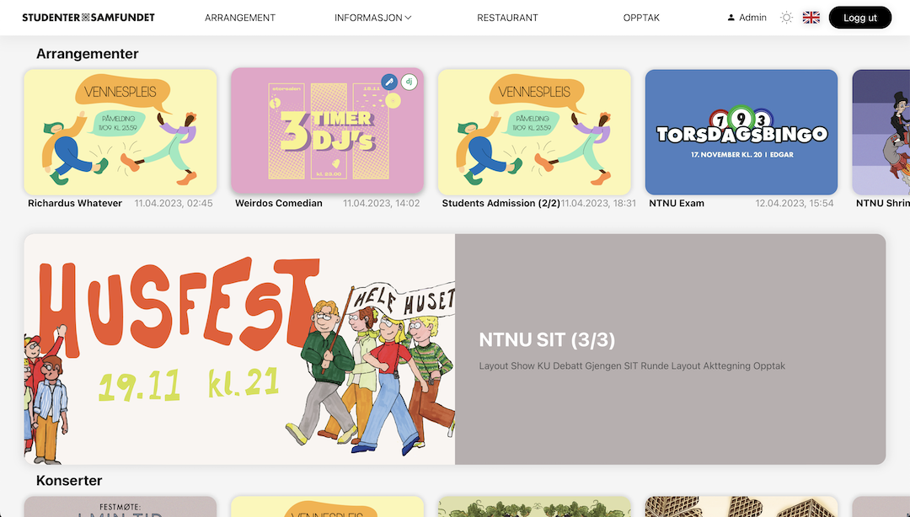

# Samfundet4



## Documentation

- **[Technical Documentation](/docs/technical/README.md)**
- [Work Methodology](/docs/work-methodology.md)
- [Useful Commands](/docs/useful-commands.md)
- [Technologies used on Samf4 🤖](/docs/technical/Samf4Tech.md)
- [Useful Docker aliases](/docs/docker-project-specific-commands.md)
## Installation

We have a script that handles all installation for you. To run the script, a Github Personal Access Token (PAT) is required.
You can make one here https://github.com/settings/tokens/new. Tick scopes `repo`, `read:org` and `admin:public_key`),
then store the token somewhere safe (Github will never show it again).

Copy these commands (press button on the right-hand side of the block)
and run from the directory you would clone the project.

```sh
# Interactive
read -s -p "Github PAT token: " TOKEN ; X_INTERACTIVE=y /bin/bash -c "$(curl -fsSL https://$TOKEN@raw.githubusercontent.com/Samfundet/Samfundet4/master/{bash_utils.sh,install.sh})" && . ~/.bash_profile && cd Samfundet4; unset TOKEN; unset X_INTERACTIVE;
```

<details>
<summary>Non-interactive (show/hide)</summary>

```sh
# Non-interactive
read -s -p "Github PAT token: " TOKEN ; X_INTERACTIVE=n /bin/bash -c "$(curl -fsSL https://$TOKEN@raw.githubusercontent.com/Samfundet/Samfundet4/master/{bash_utils.sh,install.sh})" && . ~/.bash_profile && cd Samfundet4; unset TOKEN; unset X_INTERACTIVE;
```

<!--
cd ~/my-projects/test; rm -rf Samfundet4; read -s -p "Github PAT token: " TOKEN ; X_INTERACTIVE=y /bin/bash -c "$(curl -fsSL https://$TOKEN@raw.githubusercontent.com/Samfundet/Samfundet4/master/{bash_utils.sh,install.sh})" && . ~/.bash_profile && cd Samfundet4; unset TOKEN; unset X_INTERACTIVE;
 -->
</details>

<details>
<summary>Flags explained (show/hide)</summary>

> - X_INTERACTIVE (y/n): determines how many prompts you receive before performing an action.  
>   curl:
> - -f: fail fast
> - -s: silent, no progress-meter
> - -S: show error on fail
> - -L: follow redirect

</details>

<br>
<br>
<br>
