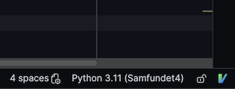
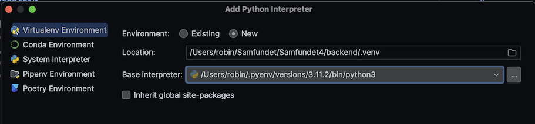
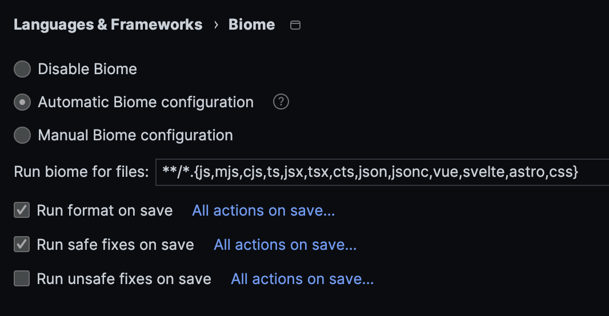

[**&larr; Back: Getting started**](../introduction.md)

# JetBrains setup

This will give some pointers on how to set up your JetBrains IDE (WebStorm/PyCharm). Luckily for you, there's not much
to be done, since JetBrains IDEs require very little configuration to be productive.

Keep in mind that all the mentioned plugins are just recommended, they're not required to develop on the project. The
linters and formatters can be run through the terminal, but having them integrated in your IDE does make life a bit
easier.

Contents:

- [PyCharm](#pycharm)
  - [Plugins](#plugins)
  - [Python Interpreter](#python-interpreter)
- [WebStorm](#webstorm)
  - [Plugins](#plugins-1)
  - [Dependencies](#dependencies)

---

## PyCharm

### Plugins

- [IdeaVim](https://plugins.jetbrains.com/plugin/164-ideavim)
  - The most important one
  - Add `set relativenumber` to `~/.ideavimrc` to get relative line numbering in your editor!
    - You can open this file by clicking the "V" logo in the bottom right of your editor then `Open ~/.ideavimrc`
- [ruff](https://plugins.jetbrains.com/plugin/20574-ruff)
  - Formatter/linter for Python

### Python Interpreter

Not having the correct interpreter selected in PyCharm can cause the IDE to not understand what Python version the
project is using, and it'll fail to resolve dependencies, causing a lot of red lines! If you are running the project in
Docker, you will also need to install dependencies locally, since the IDE doesn't check files inside the Docker
container.

You can see what interpreter is currently selected in the bottom toolbar:



To create an interpreter, click the button on the toolbar shown above,
then `Add new interpreter -> Add Local Interpreter...`.

Select `Samfundet4/backend/.venv` as the location, and select the correct Python version as the Base interpreter. If
your system's Python version differs from what Samfundet4 expects (3.11 at the time of writing this), then you can
use [pyenv](https://github.com/pyenv/pyenv) to easily download another version. Then click OK to add it.



After the interpreter has been created and selected, you can then install the dependencies inside the virtual
environment:

```bash
~/Samfundet4 » source .venv/bin/activate
(.venv) ~/Samfundet4 » poetry install
```

---

## WebStorm

### Plugins

- [IdeaVim](https://plugins.jetbrains.com/plugin/164-ideavim)
  - The most important one
  - Add `set relativenumber` to `~/.ideavimrc` to get relative line numbering in your editor!
    - You can open this file by clicking the "V" logo in the bottom right of your editor then `Open ~/.ideavimrc`
- [Biome](https://plugins.jetbrains.com/plugin/22761-biome)
  - Formatter/linter for frontend code.
  - Below is the recommended configuration (`Settings -> Language & Frameworks -> Biome`). It'll automatically format
    and apply safe fixes on save (which in the
    JetBrains world means when you tab/switch windows)
    

### Dependencies

If you are running the project in Docker, you will also need to install dependencies locally, since the IDE doesn't
check files inside the Docker container.

To do so, ensure you have [node](https://nodejs.org/en) and [yarn](https://classic.yarnpkg.com/lang/en/docs/install/)
installed. Then simply run yarn to install the dependencies.

```bash
~/Samfundet4 » cd frontend
~/Samfundet4/frontend » yarn
```
